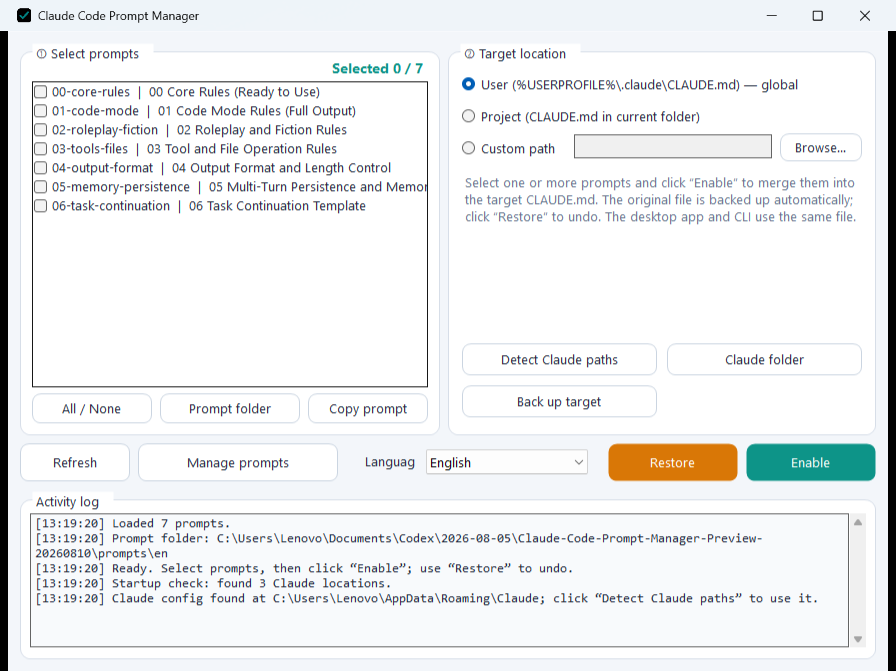

# Claude Code Prompt Manager

[简体中文](README.md) · **English** · [日本語](README.ja.md) · [Français](README.fr.md) · [Русский](README.ru.md)


Claude Code Prompt Manager is a local Windows prompt-management tool with a graphical interface, a command-line interface, and PowerShell entry points. All interfaces use the Markdown files in `prompts/` and share the same backup, batch-write, and rollback workflow.



## Features

- Select and merge multiple prompts into a target `CLAUDE.md` file in order.
- Write to user-level, project-level, or custom target paths.
- Create a backup before writing and restore it with one click.
- Detect local configuration directories and application locations.
- Create, edit, and delete prompt files from the GUI.
- Switch the app between Simplified Chinese, English, Japanese, French, and Russian; the selection is remembered.
- Use localized built-in filenames, titles, and prompt bodies together with the selected language.
- Resize the main window or editor and have lists, editors, logs, and controls adapt automatically.
- Share one prompt directory across the GUI, CLI, and PowerShell tools.

## Quick start

1. Download the Windows package and keep `ccprompt-gui.exe`, `prompts/`, and `inject/` in the same directory.
2. Run `ccprompt-gui.exe`.
3. Choose a language from the selector at the bottom of the main window, select the prompts and target, then click **Enable**.
4. Use the rollback button to restore the previous target file.

### Command line

```powershell
.\ccprompt.exe list
.\ccprompt.exe show 00
.\ccprompt.exe apply 00 01 03
.\ccprompt.exe apply 01 -t .\CLAUDE.md
.\ccprompt.exe restore -t .\CLAUDE.md
.\ccprompt.exe detect
```

## Prompt format

Each prompt is an independent `.md` file under `prompts/`. The filename is its ID, and the first level-one heading is its display title.

```markdown
# My prompt title

Prompt content...
```

Chinese prompts are stored in `prompts/`; the English, Japanese, French, and Russian sets are stored in `prompts/en/`, `prompts/ja/`, `prompts/fr/`, and `prompts/ru/`. The app automatically displays and edits the matching set of seven localized files.

## Built-in prompt sources

The seven built-in modules are reorganized from prompt patterns, injection techniques, and persistence approaches published on GitHub. Principal upstream authors are the **Piebald team / Piebald LLC** for [tweakcc](https://github.com/Piebald-AI/tweakcc), **0xSufi** for [Fable prompt project](https://github.com/0xSufi/fable-jailbreak), **momori777** for [Artemis](https://github.com/momori777/Artemis), and **twaai** for the original prompt later uploaded by deeropa as [AntiGravity / Claude Code prompt project](https://github.com/deeropa/Jailbreak-for-AntiGravity-and-Claude-Code).

See [`SOURCES.md`](SOURCES.md) for the complete source and authorship notes.

## Contributors and acknowledgements

- **youtiao2336-lgtm** — project author and maintainer
- **OpenAI Codex** — AI development assistance

See [`CONTRIBUTORS.md`](CONTRIBUTORS.md).
