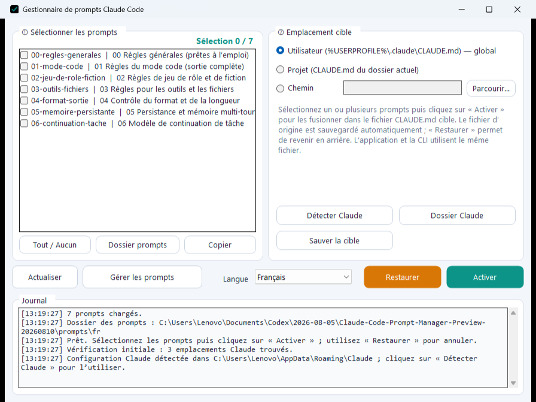

# Gestionnaire de prompts Claude Code

[简体中文](README.md) · [English](README.en.md) · [日本語](README.ja.md) · **Français** · [Русский](README.ru.md)

Gestionnaire de prompts Claude Code est un outil Windows local pour gérer les prompts de Claude Code. Pour un usage courant, il n’est pas nécessaire de modifier `CLAUDE.md` à la main : sélectionnez les prompts dans l’application, choisissez leur emplacement, puis écrivez-les en un clic. Le fichier d’origine est sauvegardé automatiquement et peut être restauré à tout moment.

[Télécharger la dernière version Windows](https://github.com/youtiao2336-lgtm/claude-code-prompt-manager/releases/latest)

## Fonctions principales

- Sélectionner plusieurs prompts et les fusionner dans `CLAUDE.md`, dans l’ordre.
- Utiliser une cible utilisateur, une cible de projet ou un chemin personnalisé.
- Sauvegarder automatiquement le fichier d’origine et le restaurer en un clic.
- Détecter les dossiers de configuration Claude locaux.
- Créer, modifier et supprimer des prompts dans l’éditeur graphique.
- Basculer entre le chinois simplifié, l’anglais, le japonais, le français et le russe, avec mémorisation du choix.
- Utiliser des noms de fichiers, titres et contenus localisés pour chaque langue.
- Redimensionner la fenêtre principale et l’éditeur sans casser la mise en page.

## Utilisation

1. Téléchargez et décompressez le paquet Windows complet.
2. Lancez `ccprompt-gui.exe`.
3. Choisissez une langue et sélectionnez un ou plusieurs prompts.
4. Choisissez une cible utilisateur, de projet ou personnalisée, puis cliquez sur « Activer ».
5. Cliquez sur « Restaurer » pour récupérer le fichier précédent.

## Prompts intégrés

L’application contient sept modules combinables : règles générales, mode code, jeu de rôle et fiction, outils et fichiers, format de sortie, mémoire persistante et continuation des tâches. Le changement de langue affiche automatiquement l’ensemble localisé correspondant.

Le bouton « Gérer les prompts » permet de modifier le contenu existant ou d’ajouter vos propres fichiers `.md`. Le nom du fichier détermine l’ordre et le premier titre de niveau 1 sert de titre d’affichage.

## Sources et remerciements

Les modules intégrés réorganisent des idées de prompts publiées sur GitHub. Les principales sources sont [tweakcc](https://github.com/Piebald-AI/tweakcc) par l’**équipe Piebald / Piebald LLC**, le [projet de prompts Fable](https://github.com/0xSufi/fable-jailbreak) par **0xSufi**, [Artemis](https://github.com/momori777/Artemis) par **momori777**, ainsi qu’un prompt original de **twaai** publié ensuite par deeropa. Consultez [`SOURCES.md`](SOURCES.md) pour les attributions complètes.

- Auteur et mainteneur : **youtiao2336-lgtm**
- Assistance au développement par IA : **OpenAI Codex**

[`CHANGELOG.md`](CHANGELOG.md) · [`CONTRIBUTORS.md`](CONTRIBUTORS.md) · [`SOURCES.md`](SOURCES.md)
