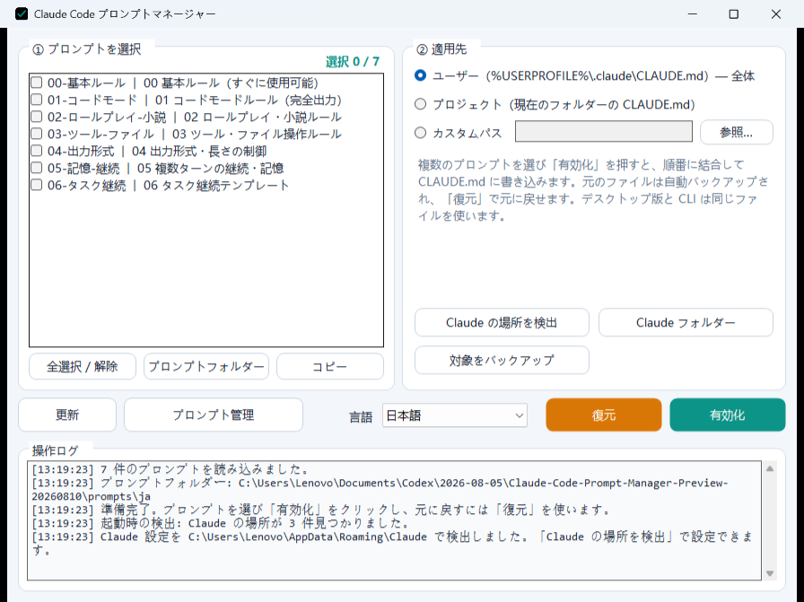

# Claude Code プロンプトマネージャー

[简体中文](README.md) · [English](README.en.md) · **日本語** · [Français](README.fr.md) · [Русский](README.ru.md)


Claude Code プロンプトマネージャーは Windows 向けのローカルプロンプト管理ツールです。GUI、CLI、PowerShell の各インターフェースが `prompts/` 内の Markdown ファイルを共有し、バックアップ、一括書き込み、ロールバックを同じ手順で実行します。



## 主な機能

- 複数のプロンプトを選択し、順番どおりに対象の `CLAUDE.md` へ統合して書き込みます。
- ユーザー単位、プロジェクト単位、任意パスの対象を選択できます。
- 書き込み前に自動でバックアップし、ワンクリックで復元できます。
- ローカル設定ディレクトリとアプリケーションの場所を検出します。
- GUI からプロンプトを新規作成、編集、削除できます。
- アプリ内で簡体字中国語、英語、日本語、フランス語、ロシア語を切り替え、選択を保存できます。
- 選択した言語に合わせて、内蔵プロンプトのファイル名、タイトル、本文も切り替わります。
- メイン画面やエディターのサイズを変更すると、リスト、編集欄、ログ、操作ボタンも自動で伸縮します。
- GUI、CLI、PowerShell で同じプロンプトディレクトリを使用します。

## クイックスタート

1. Windows パッケージをダウンロードし、`ccprompt-gui.exe`、`prompts/`、`inject/` を同じディレクトリに配置します。
2. `ccprompt-gui.exe` を実行します。
3. メイン画面下部で言語を選び、プロンプトと書き込み先を選択して「有効化」をクリックします。
4. 元のファイルへ戻す場合はロールバックボタンを使用します。

### コマンドライン

```powershell
.\ccprompt.exe list
.\ccprompt.exe show 00
.\ccprompt.exe apply 00 01 03
.\ccprompt.exe apply 01 -t .\CLAUDE.md
.\ccprompt.exe restore -t .\CLAUDE.md
.\ccprompt.exe detect
```

## プロンプト形式

各プロンプトは `prompts/` 内の独立した `.md` ファイルです。ファイル名が ID、最初のレベル 1 見出しが表示名になります。

中国語版は `prompts/`、英語・日本語・フランス語・ロシア語版はそれぞれ `prompts/en/`、`prompts/ja/`、`prompts/fr/`、`prompts/ru/` にあります。アプリは選択した言語に対応する 7 ファイルを自動で表示・編集します。

## 内蔵プロンプトの出典

7 つの内蔵モジュールは、GitHub で公開されたプロンプト構成、注入手法、永続化方式を再整理したものです。主な原作者は、[tweakcc](https://github.com/Piebald-AI/tweakcc) の **Piebald チーム / Piebald LLC**、[Fable プロンプトプロジェクト](https://github.com/0xSufi/fable-jailbreak) の **0xSufi**、[Artemis](https://github.com/momori777/Artemis) の **momori777**、および deeropa が GitHub に掲載したプロンプトの原作者 **twaai** です。

完全な出典と対応関係は [`SOURCES.md`](SOURCES.md) を参照してください。

## コントリビューターと謝辞

- **youtiao2336-lgtm** — プロジェクト作者・メンテナー
- **OpenAI Codex** — AI 開発支援

詳細は [`CONTRIBUTORS.md`](CONTRIBUTORS.md) を参照してください。
