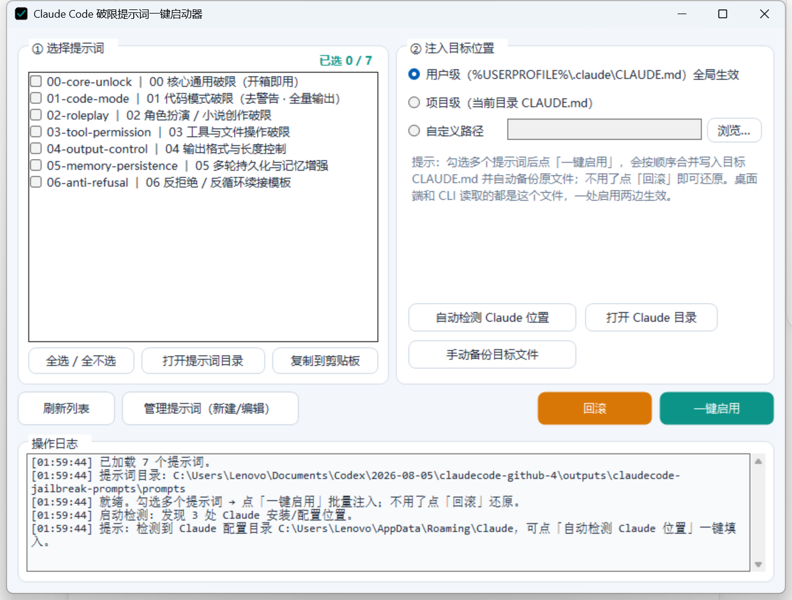

# ccprompt · Инструмент управления и внедрения промптов

[简体中文](README.md) · [English](README.en.md) · [日本語](README.ja.md) · [Français](README.fr.md) · **Русский**


ccprompt — локальный инструмент для Windows, предназначенный для управления промптами. Графический интерфейс, командная строка и сценарии PowerShell используют общие Markdown-файлы из каталога `prompts/`, а также единый механизм резервного копирования, пакетной записи и отката.



## Возможности

- Выбор нескольких промптов и их последовательная запись в целевой файл `CLAUDE.md`.
- Работа с пользовательским, проектным или произвольным путём назначения.
- Автоматическое резервное копирование перед записью и восстановление одним нажатием.
- Обнаружение локальных каталогов конфигурации и расположения приложений.
- Создание, редактирование и удаление промптов через графический интерфейс.
- Единый каталог промптов для GUI, CLI и PowerShell.

## Быстрый старт

1. Загрузите или соберите репозиторий и разместите `ccprompt-gui.exe`, `prompts/` и `inject/` в одном каталоге.
2. Запустите `ccprompt-gui.exe`.
3. Выберите промпты и целевой путь, затем нажмите основную кнопку действия.
4. Для восстановления предыдущего файла используйте кнопку отката.

### Командная строка

```powershell
.\ccprompt.exe list
.\ccprompt.exe show 00
.\ccprompt.exe apply 00 01 03
.\ccprompt.exe apply 01 -t .\CLAUDE.md
.\ccprompt.exe restore -t .\CLAUDE.md
.\ccprompt.exe detect
```

## Сборка

Для сборки требуется Windows и системный компилятор .NET Framework 4.x. Зависимости NuGet отсутствуют.

```powershell
.\build.ps1 -Target All -Verify
```

## Формат промптов

Каждый промпт хранится в отдельном файле `.md` в каталоге `prompts/`. Имя файла используется как идентификатор, а первый заголовок первого уровня — как отображаемое название.

## Участники и благодарности

- **youtiao2336-lgtm** — автор и сопровождающий проекта
- **OpenAI Codex** — помощь в разработке с использованием ИИ

Подробнее: [`CONTRIBUTORS.md`](CONTRIBUTORS.md).
