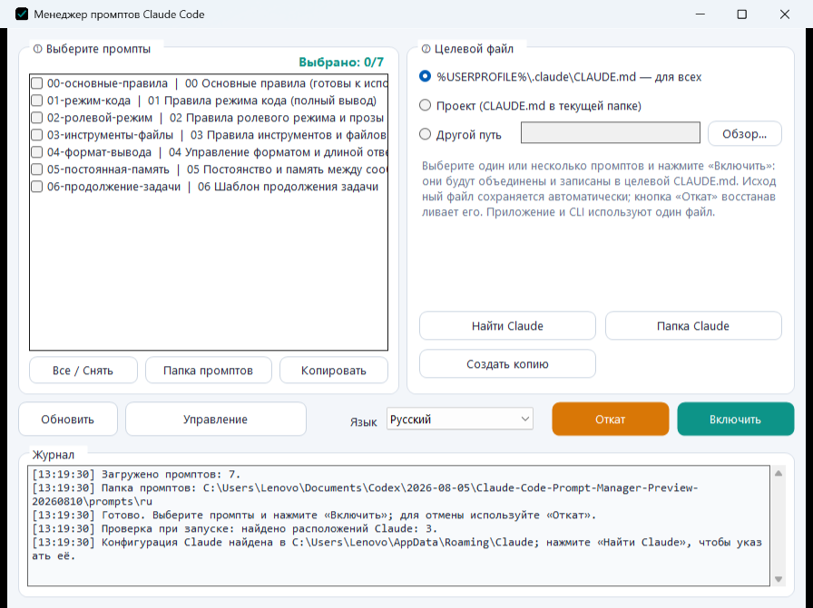

# Менеджер промптов Claude Code

[简体中文](README.md) · [English](README.en.md) · [日本語](README.ja.md) · [Français](README.fr.md) · **Русский**

Менеджер промптов Claude Code — локальное приложение для Windows. При обычном использовании не требуется вручную редактировать `CLAUDE.md`: выберите промпты в интерфейсе, укажите место применения и запишите их одним нажатием. Исходный файл автоматически сохраняется и может быть восстановлен в любое время.

[Скачать последнюю версию для Windows](https://github.com/youtiao2336-lgtm/claude-code-prompt-manager/releases/latest)

## Основные возможности

- Выбор нескольких промптов и их последовательная запись в `CLAUDE.md`.
- Пользовательский, проектный или произвольный путь назначения.
- Автоматическая резервная копия и восстановление одним нажатием.
- Обнаружение локальных каталогов конфигурации Claude.
- Создание, редактирование и удаление промптов в графическом редакторе.
- Переключение между упрощённым китайским, английским, японским, французским и русским языками с сохранением выбора.
- Локализованные имена файлов, заголовки и содержимое для каждого языка.
- Автоматическая адаптация интерфейса при изменении размера окна.

## Использование

1. Скачайте и распакуйте полный пакет для Windows.
2. Запустите `ccprompt-gui.exe`.
3. Выберите язык и один или несколько промптов.
4. Выберите пользовательскую, проектную или произвольную цель и нажмите «Включить».
5. Нажмите «Откат», чтобы вернуть предыдущий файл.

## Встроенные промпты

В приложение входят семь комбинируемых модулей: основные правила, режим кода, ролевой режим и художественный текст, инструменты и файлы, формат вывода, постоянная память и продолжение задачи. При смене языка автоматически загружается соответствующий локализованный набор.

Кнопка «Управление» позволяет изменять существующие промпты и добавлять собственные файлы `.md`. Имя файла задаёт порядок, а первый заголовок первого уровня используется как отображаемое название.

## Источники и благодарности

Встроенные модули перерабатывают идеи промптов, опубликованные на GitHub. Основные источники: [tweakcc](https://github.com/Piebald-AI/tweakcc) от **команды Piebald / Piebald LLC**, [проект промптов Fable](https://github.com/0xSufi/fable-jailbreak) от **0xSufi**, [Artemis](https://github.com/momori777/Artemis) от **momori777**, а также исходный промпт **twaai**, позднее опубликованный deeropa. Полная информация об авторах приведена в [`SOURCES.md`](SOURCES.md).

- Автор и сопровождающий: **youtiao2336-lgtm**
- Помощь в разработке с использованием ИИ: **OpenAI Codex**

[`CHANGELOG.md`](CHANGELOG.md) · [`CONTRIBUTORS.md`](CONTRIBUTORS.md) · [`SOURCES.md`](SOURCES.md)
